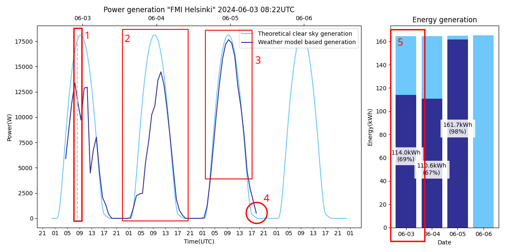
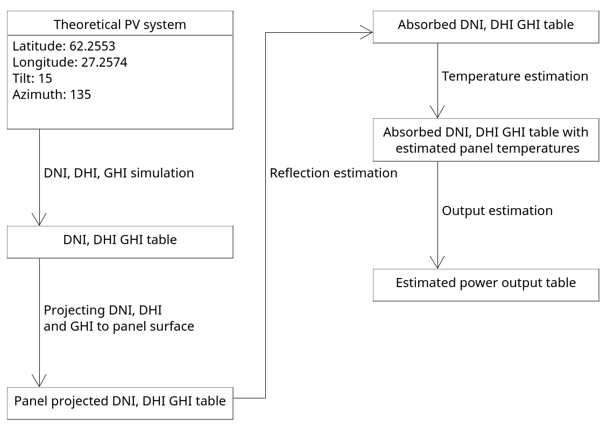

# FMI solar pv forecast
**Last update 2024-06-03**

### Description
Python code for predicting the output from a solar PV installation at given coordinates and panel installation angles. The intention of this project is to offer a configurable and physically accurate solar PV forecast model for PV installation operators within Finland. License allows for commercial and non-commercial usage.

### Features
- Adjustable simulation parameters:
    - Geolocation.
    - Panel angles.
    - ~~Time and time zone.~~ **NOT IMPLEMENTED**
    - Temporal resolution.
    - Installation size.
    - Wind speed and air temperature.
- Physically accurate irradiance simulations with DHI, DNI and GHI irradiance components:
    - Clear sky simulations with models from PVlib.
    - Weather-forecast-based simulations from FMIopen.
- Physically accurate transposition and correction functions:
    - Geometric projections of solar irradiance components to solar panel surface.
    - Reflective loss modeling.
    - Panel temperature modeling.
    - Modeling temperature induced losses.
- Plotting:
    - Clear sky energy generation estimate.
    - Weather-model-based energy generation estimate.
    - Combined plotting:
      - Shows the theoretical maximum generation and weather-model-based generation side by side.
      - Estimates kWh generation per day.

# Generating a new plot
1. First adjust parameters in config.py to match the simulated PV installation. Important parameters are geolocation, panel angles
and rated power. Other parameters such as module elevation, wind speed and air temperature can be used for fine-tuning.

2. Run function combined_processing_of_data() inside file main.py. This function will execute by default if main.py is not modified.

3. Open generated plot from folder "output". Path to file should be similar to "output/FMI Helsinki-2024-06-03 08:03.png"


# Reading the plot


Simulated PV output should resemble the following picture. Dark blue line marks the weather model based generation in both
line and bar charts whereas the lighter blue corresponds to a theoretical cloud free power output estimate.

Dashed vertical line (1) marks the simulation runtime. This time is the same as the timestamp in plot title.

During predicted cloudy or partially cloudy days(2) the weather model based generation is lower than theoretical cloud free generation.

During predicted cloud free days(3) both estimates should be within a small margin of oneanother. The deviation between models
can increase depending on air temperatures and other factors.

Weather model based DNI, DHI, GHI are available only for a 66-hour period. This means that the line for estimated output
stops on either 3rd or 4th day depending on simulation runtime. Stopping point marked as (4).

Bar chart contains a comparison of theoretical cloudfree and theoretical clear sky PV output. In (5) the estimated PV output
is marked as 114kWh which is 69% of the ~165kWh power generation estimated by the clear sky model. This estimate is calculated
based on the data period available from FMI open data, meaning that power generation before simulation runtime(1) is included in
the data for the first day.

**Notes:** 
* Due to shadows cast by trees and other structures, deviations between weather predictions and real observed weather, the
forecast may deviate significantly from observed PV output. 
* The forecast has been tested on real PV data from installations without major shadowing and the results show near perfect results during cloud free days. Results for cloudy days vary more but are still
fairly good. A selection of pictures generate during model verification and testing are included in "\documentation_pictures\system verification plots".

## Possible issues
Simulated peak generation is higher than real PV output of my system.
  * PV panels may be hotter than model suggests -> Overestimate ambient air temperature in config.py. Even a delta of 5 degrees
  has significant influence on efficiency.
  * PV panels degrade over time -> Adjust rated power to 90% to 98% of the panel kWh rating value.
  * Panels may be dusty -> Wash panels or wait for rain to do it for you.

Real output sometimes higher than both clear sky and weather model based generation.
  * Reflections from clouds can increase PV output if direct sunlight is not blocked. -> No changes needed.
  * Ambient temperature might be lower than temperature used for simulations -> Increase air temperature.


Real output is almost always higher than both clear sky and weather model based generation.
  * Panel angles of the PV system or the rated power values of the real PV system are likely to be better than the values
  used for simulation.
  * Ground reflectivity might be higher than typical. Increase albedo -variable in config.py. Wikipedia article https://en.wikipedia.org/wiki/Albedo contains a list of typical albedo values for terrain types.

Real PV system includes panels at multiple installation angles, and thus it cannot be simulated.
  * The system would be capable of simulating multiple sets of panels at different angles but this is not implemented yet
due to the goal of keeping the program as minimal as possible. -> Modify code or ask us to implement the feature.
___
# Advanced usage
This code project can be modified as needed. Anything after this line is ment to describe the inner logic of the project for advanced users. For additional questions create a new issue at project github page.
___

## Terminology
- Irradiance: Solar radiation, measured in watts.
- DNI: Direct Normal Irradiance, direct sunlight radiated towards the PV panel surface. Imagine the irradiance at the 
bottom of a long tube pointing towards the Sun.
- DHI: Direct Horizontal Irradiance, indirect sunlight scattered from the atmosphere. Complement of DNI. Imagine system
which blocks direct sunlight from reaching PV surfaces but does not block any irradiance from other segments of the sky.
- GHI: Global Horizontal Irradiance. Sum of DNI and DHI.
- Panel projection/Geometric projection: Irradiance types have to be geometrically projected to the panel surface. Functions
for each irradiance type are different.
- Reflection estimation: Solar panel surfaces reflect a proportion of solar irradiance away from solar panels. These 
reflective losses depend on the angle at which irradiance reaches the panel surface. Irradiance - Reflected irradiance = Absorbed irradiance.
- Temperature estimation: Solar panel efficiency is influenced by panel temperatures. Panel temperatures can be estimated
based on absorbed radiation and assumed air temperature.
- AOI/Angle of incidence: Angle between solar panel normal and direct sunlight. 

## PV model flowchart


The PV model used by this program works according to the figure above. In theoretical clear sky PV generation simulations
the DNI, DHI, GHI table comes from PVlib simulations whereas in weather model based simulations this same table is fletched
from FMI open data service.

After the DNI, DHI, GHI -tables are ready, both theoretical and weather model based DNI, DHI and GHI are processed through the same pipeline.


### Code files and flowchart steps

- DNI, DHI, GHI simulation simulation: solar_irradiance_estimator.py, _meps_data_loader.py , meps_data_parser.py
- Projecting DNI, DHI and GHI: geometric_prjections.py
- Reflection estimation: reflection_estimator.py
- Temperature estimation: panel_temperature_estimator.py
- Output estimation: output_estimator.py

<!-- 


## Program structure
* astronomical_calculations.py
    * Used for calculating sunlight angles, required for geometric projections.
* config.py
    * Stores installation specific variables such as geolocation, ground albedo, timezone and so on.
* geometric_projections.py
    * Contains functions for projecting the three simulated irradiance components DNI, DHI, GHI to the surface of solar panels.
* main.py
    * Controls the system. Avoid writing complex code here. The file contains samples on how to operate the forecaster.
* panel_temperature_model.py
    * Solar PV module temperature estimation equations. Physically accurate, require ambient temperature, panel elevation from ground and wind speed values.
* plotter.py
    * Functions for plotting visualizations.
* reflection_estimator.py
    * Functions for estimating how much of the irradiance which hits solar panel surfaces is absorbed and not reflected away.
* solar_iradiance_estimator.py
    * Estimates solar irradiance based on given model name. Supports clear sky and weather prediction-based estimates.

**Data Flow:**
1. Use solar_irradiance_estimator.py to generate a dataframe with dni, dhi, and ghi values.
These represent different types of irradiance which is radiated towards solar panels.

2. Use geometric_projections.py to estimate how dni, dhi, and ghi are projected to solar panel surfaces. These surface projected values are stored as dni_poa, dhi_poa, ghi_poa and their sum poa.
3. Use reflection_estimator.py to estimate how much of dni_poa, dhi_poa, ghi_poa is absorbed by solar panels and how much is reflected away. Store the sum as poa_refl_cor.


**Resulting dataframe structure:**

 | time                       |   dni    |    ghi   |    dhi  |   dni_poa  | ghi_poa |  dhi_poa  |   poa  | poa_ref_cor|
|----------------------------|----------|----------|---------|------------|---------|-----------|--------|------------|
| 2023-10-13 00:00:00+03:00  |    0.00  |    0.00 |    0.00  |     0.00   |    0.00  |     0.00   |    0.00    |     0.00|
| 2023-10-13 00:15:00+03:00  |    0.00  |    0.00 |      0.00 |      0.00  |     0.00  |     0.00   |    0.00   |      0.00|
| 2023-10-13 00:30:00+03:00  |    0.00  |    0.00 |      0.00 |      0.00  |     0.00  |     0.00   |    0.00   |      0.00|
| 2023-10-13 00:45:00+03:00  |    0.00  |    0.00 |      0.00 |      0.00  |     0.00  |     0.00   |    0.00   |      0.00|
|  2023-10-13 01:00:00+03:00 |    0.00  |    0.00 |      0.00 |      0.00  |     0.00  |     0.00   |    0.00   |      0.00|

-->


## Code samples
### Pvlib data processing function:
```python
# This function is located in main.py
def get_fmi_data(day_range= 3):
    # date for simulation:
    today = datetime.date.today()
    date_start = datetime.datetime(today.year, today.month, today.day)

    # step 1. simulate irradiance components dni, dhi, ghi:
    data = solar_irradiance_estimator.get_solar_irradiance(date_start, day_count=day_range, model="fmiopen")

    # step 2. project irradiance components to plane of array:
    data = helpers.geometric_projections.irradiance_df_to_poa_df(data)

    # step 3. simulate how much of irradiance components is absorbed:
    data = helpers.reflection_estimator.add_reflection_corrected_poa_components_to_df(data)

    # step 4. compute sum of reflection corrected components:
    data = helpers.reflection_estimator.add_reflection_corrected_poa_to_df(data)

    # step 5. estimate panel temperature based on wind speed, air temperature and absorbed radiation
    data = helpers.panel_temperature_estimator.add_estimated_panel_temperature(data)

    # step 6. estimate power output
    data = helpers.output_estimator.add_output_to_df(data)

    return data
```

### PVlib and FMIopen plotting:
```python
# This function is located in main.py
def combined_processing_of_data():
    """
    Uses both pvlib and fmi open to compute solar irradiance for the next 4 days and plots both
    :return:
    """

    # helper functions:
    data_pvlib = get_pvlib_data(4)
    data_fmi = get_fmi_data(4)

    print_full(data_fmi)
    print_full(data_pvlib)
    
    # mono plotting
    plotter.plot_fmi_pvlib_mono(data_fmi, data_pvlib)

```

### Changes 2024-05-15:
- kWh values in bar plot no longer overlap.
- Line for fmi open -based pv output is now restricted to received irradiance data.
- Colors in line and bar charts are now closer to official FMI colors.
- Images are now saved as .png images in folder defined in config.py

### Changes 2024-06-03
- Vertical line added at simulation runtime.
- Changed file naming to include hour and minute of run.
- Changed title in plots to a new "sitename" date:time UTC -format.
- Added configurable wind speed and air temperature to config.py.
- Major additions to readme.md including example plot, how to generate plot, how to read plot and an advanced usage section.
- Readme now contains issues -section.
- Included some verification images from MEPS vs measured vs predicted tests which were created in model verification phase.

### Changes 2024-06-10
- Temperatures and wind speeds can now be copied to the PVlib dataframe from FMI open data. This is now done in the sample code.
- Removed older code for temp and wind speed transferring which did not work anymore.
- Removed some unnecessary code.
- Fixed an issue where processing fmi open data would change data resolution to 60 minutes. Now this is only done 
temporarily and data resolution is restored to original value after fmi data is processed.


## TODO
* Plotting does not currently show which timezone is in use. Users should not have to assume which timezone the system is using.
* ~~Add cell temperature equation to dataframe.~~ NOT NEEDED
* ~~Color plot with FMI colors.~~ DONE
* ~~Add percents to plot "weather prediction based model suggests xx% of pvlib generation"~~ DONE
* ~~Add kWh numbers to plot.~~ DONE
* Add UI?
* ~~Test with weather predictions from summer months.~~ Tested, predictions work well.
* Choose license and write public documentation.
* Wind speed and air temperature bias values could be added to config.py for local adjustments.